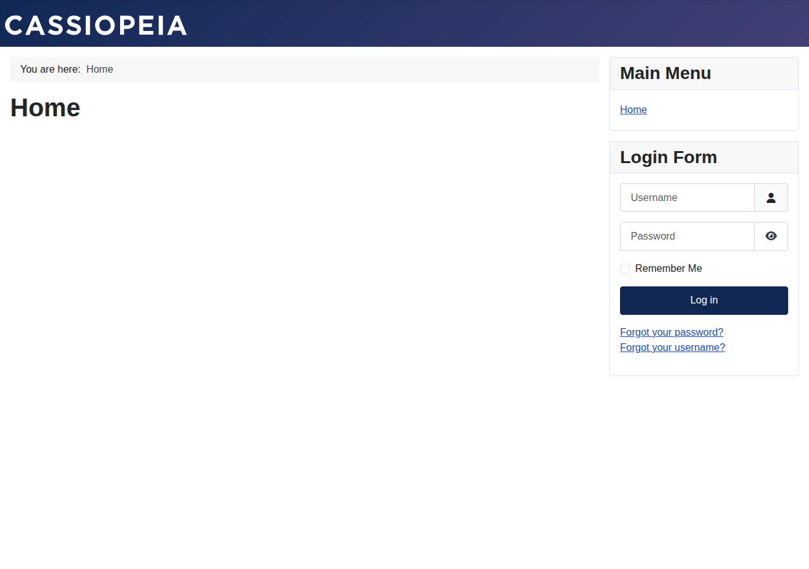
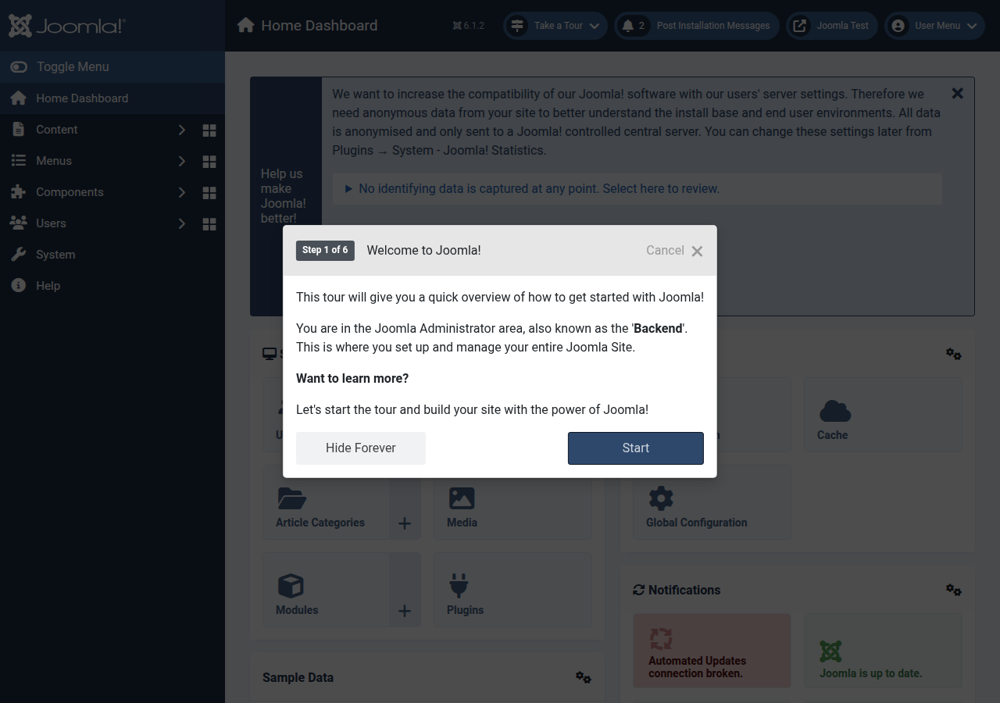

# Joomla 6.1.2 Kurulumu

Bu depodaki `joomla/` klasörüne Joomla 6.1.2 kuruldu ve çalıştığı doğrulandı.

## Ortam

| Bileşen | Sürüm |
|---|---|
| Joomla | 6.1.2 (kaynak: `joomla/joomla-cms` deposu, `6.1.2` etiketi) |
| PHP | 8.4.19 |
| MariaDB | 10.11.14 |
| Node.js / npm | 22.22.2 / 10.9.7 |
| Composer | 2.8.12 |

## Yapılan adımlar

1. `joomla/joomla-cms` deposu `6.1.2` etiketiyle `joomla/` klasörüne klonlandı.
2. PHP bağımlılıkları kuruldu (vendor dizini `joomla/libraries/vendor` altına iner):
   ```bash
   cd joomla
   composer install --no-dev --ignore-platform-req=ext-ldap
   ```
   (`ext-ldap` yalnızca LDAP eklentisi için gerekir, çekirdek çalışması için zorunlu değildir.)
3. Ön yüz varlıkları derlendi (`media/` klasörünü üretir):
   ```bash
   CYPRESS_INSTALL_BINARY=0 npm ci
   ```
4. MariaDB'de `joomla_db` veritabanı ve `joomla` kullanıcısı oluşturuldu.
5. Kurulum CLI üzerinden yapıldı:
   ```bash
   php installation/joomla.php install \
     --site-name "Joomla Test" \
     --admin-user "Admin" --admin-username admin \
     --admin-email <e-posta> --admin-password <parola> \
     --db-type mysqli --db-host localhost \
     --db-user joomla --db-pass <db-parolası> \
     --db-name joomla_db --db-prefix jos_
   ```
   Kurulum sonrası Joomla, standart davranışı gereği `installation/` klasörünü siler.
6. Site PHP dahili sunucusuyla yayınlandı:
   ```bash
   php -S 127.0.0.1:8080 -t joomla
   ```

## Önemli not: PHP dahili sunucusunda `$live_site`

PHP dahili sunucusunda yönetici paneli varlık adreslerini (`css/js`) yanlışlıkla
`/administrator/media/...` altında üretir ve panel stilsiz görünür. Çözüm,
`configuration.php` içinde site adresini sabitlemek:

```php
public $live_site = 'http://127.0.0.1:8080';
```

Apache/Nginx altında bu ayara gerek yoktur.

## Doğrulama

- Ana sayfa `http://127.0.0.1:8080/` → HTTP 200, Cassiopeia teması düzgün render ediyor.
- Yönetici paneli `http://127.0.0.1:8080/administrator/` → HTTP 200, `admin`
  kullanıcısıyla giriş yapıldı; panoda "Joomla! version is 6.1.2" ve
  "Joomla is up to date" görünüyor.

| Ana sayfa | Yönetici paneli |
|---|---|
|  |  |

## Depoda ne var, ne yok

`joomla/.gitignore` gereği üretilen/makineye özgü dosyalar depoya girmez:
`node_modules/`, `libraries/vendor/`, `media/` (derlenmiş varlıklar) ve
`configuration.php` (veritabanı kimlik bilgileri içerir). Taze bir klonda
siteyi ayağa kaldırmak için yukarıdaki 2-6. adımlar tekrarlanmalıdır.
