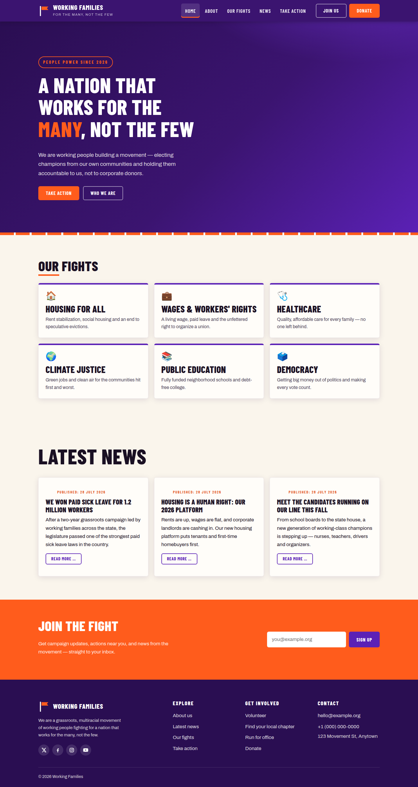
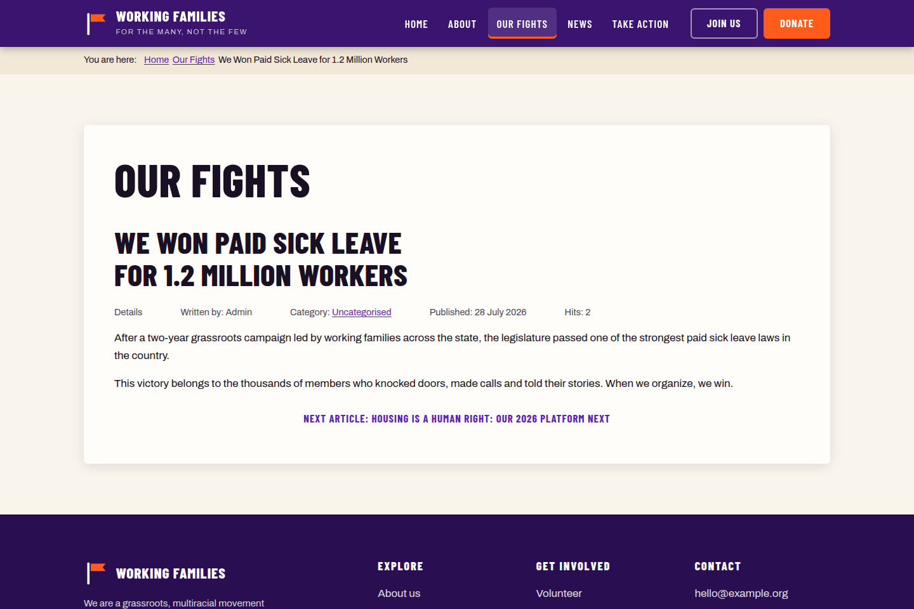
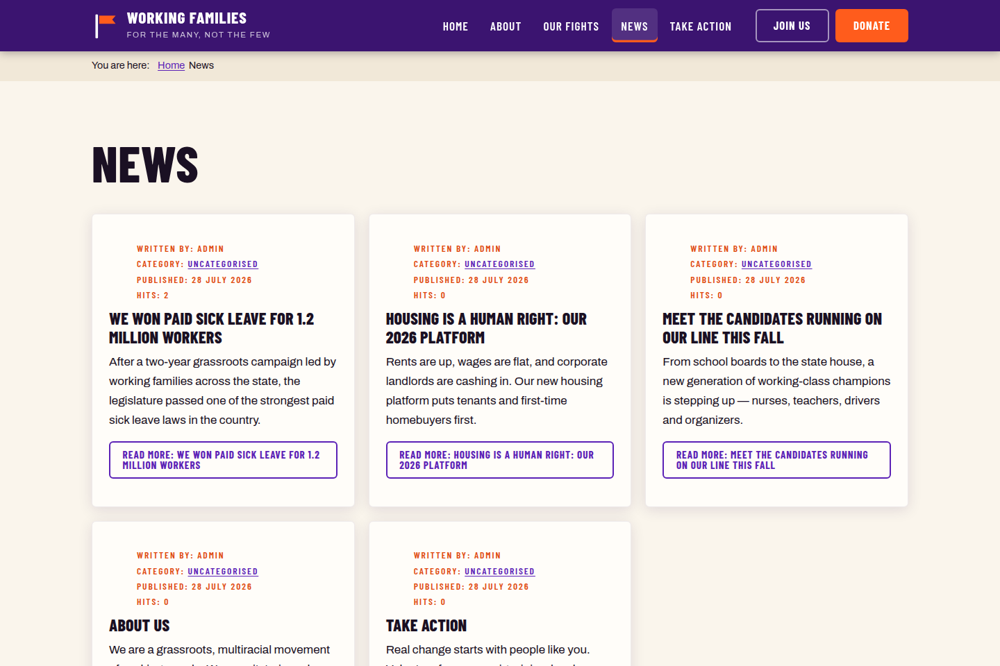
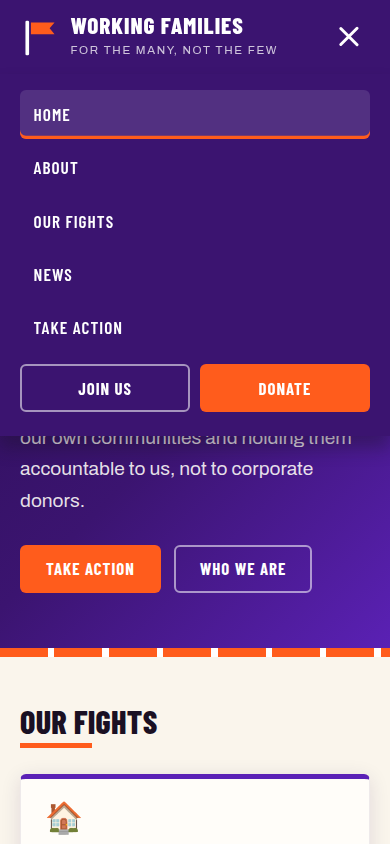

# wfp — Joomla Site Teması

`joomla/templates/wfp/` altında, tasarım kaynağı olarak
[workingfamilies.org](https://workingfamilies.org/) (Working Families Party)
alınarak sıfırdan yazılmış bir Joomla 6 site teması.

> Not: Bu ortamın ağ vekili workingfamilies.org'a doğrudan erişime izin
> vermediği için tema, sitenin bilinen marka kimliği üzerinden inşa edildi:
> mor + turuncu palet, krem zemin, kalın kondanse büyük harf başlıklar,
> aktivist/poster estetiği. Birebir kopya değil, aynı tasarım dilinde özgün
> bir uygulamadır (logo ve içerik dahil hiçbir varlık kopyalanmadı).

## Tasarım dili

| Öğe | Değer |
|---|---|
| Ana mor | `#5b21b6` (koyu tonlar `#3b1470`, `#2a0e52`) |
| Vurgu turuncusu | `#ff5c1c` |
| Zemin | Krem `#faf5ec` |
| Başlık fontu | Barlow Condensed 500–800 (büyük harf, kondanse) |
| Metin fontu | Archivo 400–700 |

Fontlar `@fontsource` npm paketlerinden alınıp temaya gömüldü (OFL lisansı,
`latin` + Türkçe karakterler için `latin-ext` setleri). Dış CDN bağımlılığı yok.

## Tema yapısı

```
joomla/templates/wfp/
├── templateDetails.xml   # manifest: pozisyonlar + tema parametreleri
├── index.php             # ana şablon (header, hero, bölümler, footer)
├── component.php         # modal/yazdırma görünümü
├── error.php             # 404/500 sayfası
├── offline.php           # bakım modu sayfası
├── css/template.css      # tüm stiller (~tek dosya, değişkenlerle)
├── js/template.js        # mobil menü aç/kapa
├── fonts/                # woff2 dosyaları
├── images/favicon.svg
├── html/layouts/chromes/ # wfpsection, wfpcard, wfpfooter modül krom stilleri
└── language/en-GB/       # tpl_wfp.ini dil dosyaları
```

### Modül pozisyonları

`topbar`, `below-top`, `menu`, `search`, `hero`, `top-a`, `top-b`,
`main-top`, `main-bottom`, `breadcrumbs`, `sidebar-right`, `cta`,
`footer-a/b/c`, `copyright`, `debug`

### Tema parametreleri (Site → Templates → Styles → WFP)

Slogan, Donate/Join buton metni ve adresi, dört sosyal medya adresi,
footer tanıtım metni.

## Kurulum (yeni bir ortamda)

1. Tema dosyaları `joomla/templates/wfp/` altında; keşfet ve kur:
   ```bash
   php cli/joomla.php extension:discover
   php cli/joomla.php extension:discover:install --eid <wfp-eid>
   ```
2. Varsayılan yap: Administrator → System → Templates → Styles → WFP → Default
   (veya `jos_template_styles` tablosunda `home=1`).
3. Ana menü modülünü `menu` pozisyonuna taşı.

## Demo içerik

`docs/wfp-demo/` altında:

- `seed.php` — makaleler (3 haber + Hakkımızda + Harekete Geç) ve menü
  öğelerini oluşturur. Joomla kökünden çalıştırılır: `php seed.php`
- `seed_modules.php` — hero, dava kartları (6 adet), bülten CTA bandı ve
  üç footer modülünü oluşturur.
- `joomla_db.sql` — bu demonun eksiksiz veritabanı dökümü (test ortamı;
  admin parolası KURULUM.md'dekiyle aynıdır).

Hero, kartlar ve CTA modülleri yalnızca ana sayfaya atanmıştır
(`jos_modules_menu.menuid=101`).

## Doğrulama görüntüleri

| Sayfa | Dosya |
|---|---|
| Ana sayfa (tam) |  |
| Makale sayfası |  |
| Haber listesi |  |
| Mobil menü |  |
